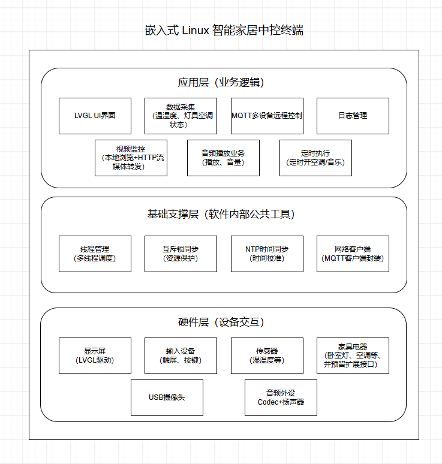
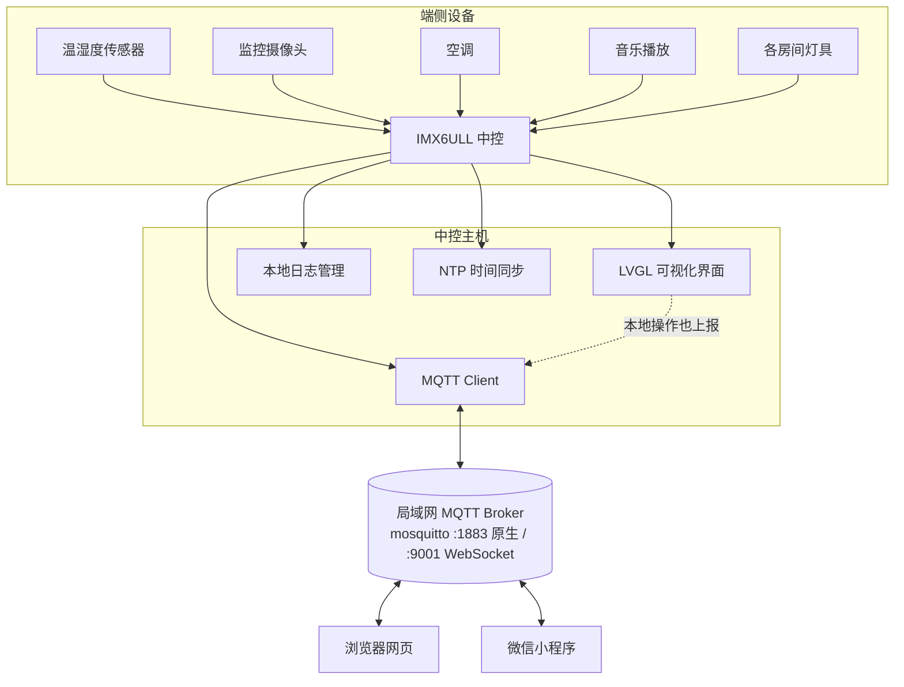

# 🔥 灶君 · 基于 IMX6ULL 的多功能智能家居中控系统

>  Zao Jun — 可实时监控全屋设备状态并远程控制的智能管家
>
>  技术平台：IMX6ULL 嵌入式 Linux · LVGL · MQTT · NTP


***

## 目录

- [项目简介](#项目简介)
- [核心功能](#核心功能)
- [技术架构](#技术架构)
- [系统架构图](#系统架构图)
- [多端支持](#多端支持)
- [MQTT topic约定](#mqtt-topic约定)
- [项目结构](#项目结构)
- [开发进度](#开发进度)
- [Roadmap](#roadmap)
- [相关文档](#相关文档)

***

## 项目简介

本项目基于 **IMX6ULL 嵌入式 Linux 平台**，开发一款多功能智能家居中控系统：

- 采用 **LVGL** 搭建嵌入式可视化 GUI，提供本地人机交互界面；
- 实现**多源传感器数据采集**与**家电设备状态监测**，覆盖监控摄像头、温湿度传感器、空调、音乐播放及各房间灯具等设备；
- 提供**本地日志管理**能力，记录系统运行日志、错误日志、事件日志等；
- 通过 **NTP** 协议与互联网时间服务器同步，保证系统时间准确可靠；
- 依托 **MQTT** 物联网通信协议，打通设备端与各控制端的数据链路；
- 支持**微信小程序、浏览器网页、开发板显示屏**等多端远程监测与设备控制。

项目当前处于**开发阶段**：板端 LVGL 界面、温湿度采集、灯具与空调的开关控制及状态显示、NTP 对时、MQTT 接入，以及**开发板显示屏 / 浏览器网页 / 微信小程序三端的双向控制与状态同步**均已跑通——任意一端操作开关，另外两端都会实时看到状态变化；本地日志管理、摄像头 / 音频播放 / 定时任务页面仍在开发中。

### 🔥 名字由来

「灶君」取自中国民间信仰中的**灶神**——他是唯一住在凡人家里的神，主管家家户户饮食，后演变为保佑家庭合欢平安。项目以此命名，寓意这款中控系统就像一位住在你家、守护全屋设备的"灶王爷"，帮助你监控家庭设备情况、提供及时的预警并使你可以远程控制家庭设备。

***

## 核心功能

| 功能模块       | 说明                                   | 状态  |
| :--------- | :----------------------------------- | :-- |
| 板端可视化界面    | LVGL 界面外壳与主界面      | ✅ 已跑通 |
| 温湿度数据采集    | DHT11 传感器采集                 | ✅ 已跑通 |
| 家电设备控制     | 灯具与空调开关控制（GPIO）          | ✅ 已跑通 |
| 家电设备状态监测   | 状态表统一维护设备开关状态          | ✅ 已跑通 |
| NTP 网络时间同步 | 与互联网 NTP 服务器同步系统时间           | ✅ 已跑通 |
| MQTT 物联网通信 | 设备端与 Broker 双向通信：上报状态 + 接收控制指令（状态带 retain）              | ✅ 已跑通 |
| 浏览器网页端     | 网页端实时查看温湿度与设备状态，并远程控制灯具 / 空调          | ✅ 已跑通 |
| 微信小程序端     | 小程序实时查看温湿度与设备状态，并远程控制灯具 / 空调               | ✅ 已跑通 |
| 三端状态同步     | 任一端操作开关，其余两端实时更新；板端本地操作同样上报          | ✅ 已跑通 |
| 本地日志管理     | （具体日志类型规划中）        | 🚧 未开始 |
| 摄像头 / 音频 / 定时 | 摄像头预览、音乐播放、定时任务等扩展功能                  | 🚧 占位页 |

***

## 技术架构

### 一、硬件与系统

| 项目     | 选型                                                  |
| :----- | :-------------------------------------------------- |
| 主控芯片   | IMX6ULL（ARM Cortex-A7 / ARMv7-A，armhf）               |
| 操作系统   | 嵌入式 Linux 4.9.88                                    |
| 显示     | 1024×600 LCD，走 framebuffer `/dev/fb0`，32 位色深         |
| 触摸输入   | goodix 电容触摸屏，走 evdev `/dev/input/event1`            |
| 传感器    | DHT11 温湿度传感器                           |
| 执行器    | LED 指示灯、直流电机（模拟空调，INA / INB 双 GPIO 控制）               |
| 网络接入   | WiFi（RTL8723BU 驱动 `8723bu.ko`）+ `wpa_supplicant` + `udhcpc` |

### 二、软件与技术栈

| 分类         | 选型                                                              |
| :--------- | :-------------------------------------------------------------- |
| 开发语言       | C（`gnu99`）                                                       |
| 并发模型       | POSIX 多线程       |
| GUI 框架     | LVGL **v9.6.0**          |
| LVGL 后端    | fbdev + evdev； |
| 通信协议       | MQTT（设备状态上报 + 控制指令下发），局域网内通信                       |
| 时间同步       | NTP（开机对时，超时 2s 不阻塞启动）                              |
| MQTT Broker   | mosquitto **2.1.2**（跑在局域网 PC 上，三端都作为客户端接入）              |
| MQTT 客户端库  | 设备端 libmosquitto **2.0.18**（静态链接）；网页端 MQTT.js over WebSocket；小程序端 `wx.connectSocket` + 自研 MQTT 报文编解码 |

### 三、工具链与工程

| 环节        | 工具 / 做法                                                              |
| :-------- | :------------------------------------------------------------------- |
| 交叉编译工具链   | `arm-linux-gnueabihf-gcc` 11.4.0                     |
| 构建系统      | GNU Make（[usrcode/Makefile](./usrcode/Makefile)，按文件生成编译规则 + `-MMD` 自动头文件依赖）  |
| 编译选项      | `-O2 -g -Wall -std=gnu99`，`LV_CONF_INCLUDE_SIMPLE=1`                   |
| 链接方式      | 静态链接 `-static -lm -lpthread` + `libmosquitto.a`               |
| 内核模块编译    | 依赖板端内核源码树，配置 `KERN_DIR` / `ARCH` / `CROSS_COMPILE` 后交叉编译出 `.ko`      |
| 部署方式      | adb over USB（[deploy.sh](./usrcode/deploy.sh)：编译 → push 到板端 `/root` → 重启进程） |
| 启动脚本    | `/etc/init.d/S09modload`（加载驱动）、`/etc/init.d/S41wifi`（开机自动连热点）        |

> 第三方依赖说明：LVGL 源码已随仓库内置，克隆即可编译；**libmosquitto 需要自行下载并交叉编译出 ARM 静态库**，当前 [Makefile](./usrcode/Makefile) 中 `MOSQUITTO_DIR` 仍指向开发机绝对路径 `/home/lc/third_party/mosquitto-2.0.18`，换机器编译前需先改这一行。

***

## 系统架构图

> 完整的系统架构图见 [architect_design.png](./architect_design.png)。





***

## 多端支持

| 终端         | 接入方式                     | 能力                     | 状态      |
| :--------- | :----------------------- | :--------------------- | :------ |
| 🖥️ 开发板显示屏 | 原生 MQTT over TCP（`:1883`） | LVGL 本地可视化界面，支持本地查看与控制 | ✅ 已跑通   |
| 🌐 浏览器网页   | MQTT over WebSocket（`:9001`） | 远程监测设备状态、远程控制设备        | ✅ 已跑通   |
| 💬 微信小程序   | MQTT over WebSocket（`:9001`） | 远程监测设备状态、远程控制设备        | ✅ 已跑通   |

任意一端操作开关，另外两端都会在状态消息回来后同步更新；在开发板上直接拨动开关同样会上报。

***

## MQTT topic约定

三端都作为 **MQTT 客户端**接入局域网内的 mosquitto Broker（跑在 PC 上），互相之间不直连，所有消息都由 Broker 转发。主题前缀 `home/zaojun_imx6ull` 由设备端与各控制端保持一致，协议实现见 [net/mqtt_client.c](./usrcode/net/mqtt_client.c)。

| 主题                          | 方向        | 载荷                             | QoS / retain  |
| :-------------------------- | :-------- | :----------------------------- | :------------ |
| `home/zaojun_imx6ull/cmd/led`    | 控制端 → 开发板 | `on` / `off`                   | QoS 1         |
| `home/zaojun_imx6ull/cmd/ac`     | 控制端 → 开发板 | `on` / `off`                   | QoS 1         |
| `home/zaojun_imx6ull/status/led` | 开发板 → 控制端 | `on` / `off`                   | QoS 1 / retain |
| `home/zaojun_imx6ull/status/ac`  | 开发板 → 控制端 | `on` / `off`                   | QoS 1 / retain |
| `home/zaojun_imx6ull/status/env` | 开发板 → 控制端 | `{"temp":26,"humi":55}`        | QoS 0 / retain |

三条数据流：

1. **远程控制**：控制端发布 `cmd/*` → 开发板收到后驱动 GPIO 并写入设备状态表 → 随即发布 `status/*` 回执；
2. **本地操作同步**：在开发板屏幕上拨动开关 → 直接驱动硬件并发布 `status/*`，另外两端实时看到变化；
3. **环境上报**：采集线程每 2s 读一次 DHT11 写入环境状态表，上报线程每 5s 发布一次 `status/env`。

状态消息均带 **retain**，新连上的控制端无需等下一次上报，即可立刻拿到最后的设备状态。


***

## 项目结构

```
Smart_home_central/
├── README.md             # 项目说明（本文件）
├── architect_design.png  # 系统架构图
├── lv_port_pc_vscode/    # LVGL 源码
├── web/                  # 浏览器网页端（纯静态，MQTT over WebSocket）
└── usrcode/              # 板端应用源码
    ├── Makefile          # 交叉编译脚本，产出 build/main_arm
    ├── deploy.sh         # 一键部署：编译 -> adb 推送 -> 板端重启
    ├── lv_conf.h         # LVGL 裁剪配置
    ├── main.c            # 程序入口：硬件初始化 + 启动界面 + 主循环
    ├── common_type.h/.c  # 公共类型定义（设备 ID、设备状态、温湿度）
    ├── ui/               # 界面层
    ├── data/             # 数据结构层：设备状态表、环境状态表
    ├── hardware/         # 硬件驱动层：GPIO、DHT11
    ├── net/              # 通信层：NTP 对时、MQTT 客户端
    └── assets/fonts/     # 静态资源：中文黑体、FontAwesome 图标字体
```

> 微信小程序端在微信开发者工具中单独维护，未纳入本仓库；其 MQTT 报文编解码按上表主题约定实现。

***

## 开发进度

| 阶段        | 状态  |
| :-------- | :-- |
| 需求分析与架构梳理 | 已完成 |
| 业务代码开发    | 进行中 |
| 联调与稳定性测试  | 未开始 |
| 演示视频      | 未开始 |

***

## Roadmap

- [√] 需求分析与系统架构梳理
- [√] 板端 LVGL 界面外壳 + 主界面（温湿度 / 设备控制）
- [√] 温湿度数据采集（DHT11 自研内核驱动 + 采集线程）
- [√] 家电设备控制与状态监测（灯具、空调）
- [√] NTP 网络时间同步
- [√] MQTT 接入（状态上报 + 指令下发，三端互通）
- [√] 浏览器网页端适配（远程监控与控制）
- [√] 微信小程序端适配（远程监控与控制）
- [√] 三端状态双向同步
- [ ] 板端设置页 / 日志页 / 摄像头 / 音频 / 定时任务页面
- [ ] 本地日志管理模块


***

## 相关文档

- [architect_design.png](./architect_design.png) — 系统架构图
- `usrcode/` 各子目录下的 `readme` — ui / data / hardware 三层职责速览


