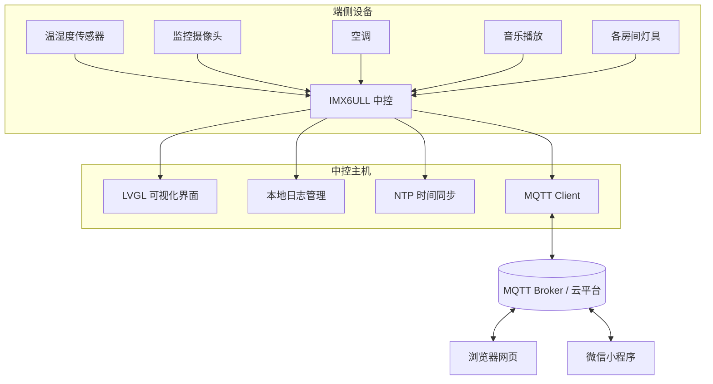

# 🔥 灶君 · 基于 IMX6ULL 的多功能智能家居中控系统

>  Zao Jun — 可实时监控全屋设备状态并远程控制的智能管家
>
>  技术平台：IMX6ULL 嵌入式 Linux · LVGL · MQTT · NTP


***

## 📋 目录

- [项目简介](#项目简介)
- [核心功能](#核心功能)
- [技术架构](#技术架构)
- [系统架构图](#系统架构图)
- [多端支持](#多端支持)
- [项目结构](#项目结构)
- [开发进度](#开发进度)
- [Roadmap](#roadmap)
- [相关文档](#相关文档)

***

## 📖 项目简介

本项目基于 **IMX6ULL 嵌入式 Linux 平台**，开发一款多功能智能家居中控系统：

- 采用 **LVGL** 搭建嵌入式可视化 GUI，提供本地人机交互界面；
- 实现**多源传感器数据采集**与**家电设备状态监测**，覆盖监控摄像头、温湿度传感器、空调、音乐播放及各房间灯具等设备；
- 提供**本地日志管理**能力，记录系统运行日志、错误日志、事件日志等；
- 通过 **NTP** 协议与互联网时间服务器同步，保证系统时间准确可靠；
- 依托 **MQTT** 物联网通信协议，打通设备端与云端的数据链路；
- 支持**微信小程序、浏览器网页、开发板显示屏**等多端远程监测与设备控制。

项目当前处于**开发阶段**：需求分析与架构梳理进行中。

### 🔥 名字由来

「灶君」取自中国民间信仰中的**灶神**——他是唯一住在凡人家里的神，主管家家户户饮食，后演变为保佑家庭合欢平安。项目以此命名，寓意这款中控系统就像一位住在你家、守护全屋设备的"灶王爷"，帮助你监控家庭设备情况、提供及时的预警并使你可以远程控制家庭设备。

***

## ⚙️ 核心功能

| 功能模块       | 说明                                   |
| :--------- | :----------------------------------- |
| 多源传感器数据采集  | 采集监控摄像头、温湿度传感器、空调、音乐播放、各房间灯具等设备的状态数据 |
| 家电设备状态监测   | 实时监测上述家电设备的运行状态并在界面呈现                |
| 本地日志管理     | 记录系统运行日志、错误日志、事件日志等（具体日志类型规划中）       |
| NTP 网络时间同步 | 与互联网 NTP 服务器同步系统时间，确保时间准确可靠          |
| MQTT 物联网通信 | 基于 MQTT 协议实现设备端与云端的双向数据通信            |
| 多端远程控制     | 通过微信小程序、浏览器网页、开发板显示屏等终端远程监测与控制设备     |

***

## 🛠️ 技术架构

| 分类     | 选型                 |
| :----- | :----------------- |
| 硬件平台   | IMX6ULL（嵌入式 Linux） |
| GUI 框架 | LVGL               |
| 通信协议   | MQTT               |
| 时间同步   | NTP                |
| 开发语言   | C                  |

***

## 🏗️ 系统架构图

> 以下为规划中的系统架构，完整架构图详见 `doc/` 目录。



***

## 📲 多端支持

| 终端         | 能力                     |
| :--------- | :--------------------- |
| 🖥️ 开发板显示屏 | LVGL 本地可视化界面，支持本地查看与控制 |
| 💬 微信小程序   | 远程监测设备状态、远程控制设备        |
| 🌐 浏览器网页   | 远程监测设备状态、远程控制设备        |

***

## 📁 项目结构

```
Smart_home_central/
├── README.md      # 项目说明（本文件）
├── TODO.md        # 任务清单，接下来要做什么
├── doc/           # 架构图、模块详解等文档
├── usrcode/       # 业务源码
└── usrlib/        # 组件库 / 第三方库
```

***

## 🚧 开发进度

| 阶段        | 状态  |
| :-------- | :-- |
| 需求分析与架构梳理 | 进行中 |
| 业务代码开发    | 未开始 |
| 联调与稳定性测试  | 未开始 |
| 演示视频      | 未开始 |

***

## 🗺️ Roadmap

- [ ] 需求分析与系统架构梳理
- [ ] 多源传感器数据采集模块
- [ ] 家电设备状态监测模块
- [ ] 本地日志管理模块
- [ ] NTP 网络时间同步
- [ ] MQTT 云平台接入与多端联动
- [ ] 微信小程序 / 网页端适配
- [ ] 整机 7×24 小时稳定性测试

***

## 📄 相关文档

- `TODO.md` — 任务清单与开发规划
- `doc/` — 系统架构图、模块设计详解等

